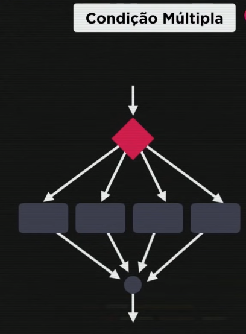

## JS - D - 12 - Condições -- Part 2

### Condição Aninhadas:


### Condição Multipla:

````
switch (expressão){
    case valor1:

    break (obrigatorio)
    case valor2:

    break (obrigatorio)
    case valor13: 

    break (obrigatorio)
    default:

    break (obrigatorio)
}
````